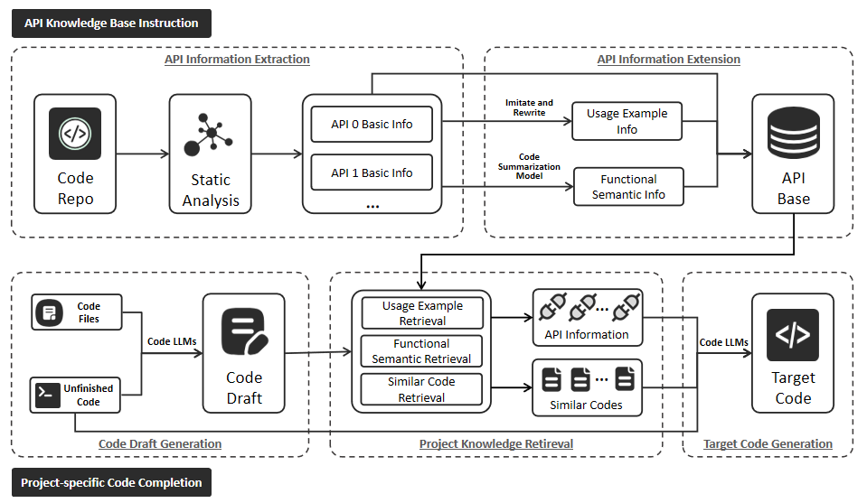

# Enhancing Project-Specific Code Completion by Inferring Intra-Project API Information

## Overview

In this paper, we follow the RAG paradigm but explore a practical approach to infer API information. Specifically, we propose a novel project-specific knowledge retrieval method that does not rely on import statements. Our method first expands the representation of intra-project API information, including usage examples and functional semantic information. Then, we use a code draft to guide the retrieval of API information required for code completion based on these two types of information. Additionally, we develop a project-specific code completion framework that not only considers similar code but also captures the intra-project API information on which the completion depends.



## Project Structure

This project contains the basic components of our approach. Here is an overview:

```shell
|-- build_func_base.py # build our api knowledge database
|-- build_func_prompt.py # search and build relevant api inforamtion 
|-- build_snippet_base.py # build code snippets database
|-- build_snippet_prompt.py # search and build similar code snippets inforamtion 
|-- build_infile.py # build infile information
|-- run.py # run the code completion pipeline
|-- eval_codematch.py # evaluate the code match performance of the code completion
|-- eval_idmatch.py # evaluate the ID match performance of the code completion
|-- utils.py # utility functions
|-- summarize_code.py # summarize code to obtain functional semantic information
|-- prompt_java # code summarization template for java
|-- prompt_py # code summarization template for python
|-- datasets # the input data for the code completion task
    |-- projbench_java.jsonl
    |-- projbench_py.jsonl
|-- repos # the checkpoints of repositories used to build our benchmark. Please email us if you need the raw data.
    |-- java 
    |-- py
```

## Quick Start

### Install Requirements

```sh
$ pip install -r requirements.txt
```

### Run the Pipeline

**API Knowledge Instruction**

The `build_function_database` function in `run.py` shows the process if building the API knowledge information database.

**Code Draft Generation**

Then we need to run the `build_code_draft_prompt` function in `run.py` get the code draft and the organize the results in the following format:

```json
{
    "prompt": "similar code snippets + unfinished code",
    "pred_res": "generated completion",
    "metadata": {...}
}
```

**Project Knowledge Retrieval & Target Code Generation**

After obtaining the code draft file, we run the `build_target_code_prompt` function in `run.py` to obtain the similar code snippets and the intra-project API information on which the completion depends.  It is worth noting that there is a parameter `mode` (full, -uer, -fsr) that can be changed to select specific components for our API Inference method.

**Evaluation**

Finally, we can evaluate the performance of the code completion with the `eval_codematch.py` and `eval_idmatch.py` scripts